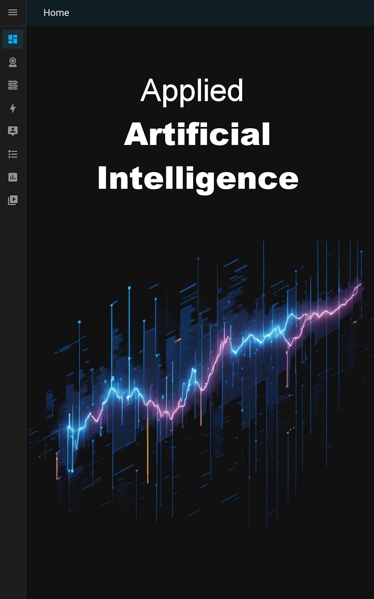

# Applied Artificial Intelligence: Neural Networks and Deep Learning with Python and TensorFlow

  
*Cover image of the ebook*

## 📖 [Get the Ebook on Amazon](https://www.amazon.com/dp/B0924XRXDX)

---

## Master Neural Networks and Deep Learning with Python and TensorFlow

**Applied Artificial Intelligence: Neural Networks and Deep Learning with Python and TensorFlow** is your ultimate guide to understanding and building AI models. Whether you're a beginner or an experienced Python developer, this book provides a step-by-step introduction to the world of Artificial Intelligence (AI) and Machine Learning (ML).

Learn how to create **production-ready AI models** using **TensorFlow** and **Keras**, and explore real-world applications like **image recognition**, **text analysis**, and **recommendation systems**.

---

## Who Should Read This Book?

This book is perfect for:
- **Python developers** who want to learn Neural Networks from scratch.
- **Beginners** in AI and Machine Learning who want a clear and practical introduction.
- Developers interested in building **real-world AI applications**.
- Anyone curious about **TensorFlow**, **Keras**, and **deep learning frameworks**.

---

## What You Will Learn

By reading this book, you will:
- Understand the **basic structure and functionality of a Neuron**.
- Learn the **math behind Neural Network learning processes**.
- Build a **character recognition model** from scratch.
- Explore **classification, regression, and clustering** use cases.
- Use **TensorFlow** to create production-ready AI models.
- Design and train models with the **Keras framework**.
- Solve real-world problems, such as:
  - Predicting the survival chances of Titanic passengers.
  - Building a **book recommendation system**.
  - Detecting **toxic language** with AI.

---

## Why Choose This Book?

### Practical Examples
This book includes hands-on examples to help you:
- Recognize handwritten characters.
- Analyze text for sentiment and toxicity.
- Build recommendation systems for personalized user experiences.

### Beginner-Friendly
Even if you're new to Python, this book provides clear explanations and step-by-step instructions to help you get started.

### Real-World Applications
Learn how AI is used in industries like:
- **Search engines**
- **Image recognition**
- **Robotics**
- **Finance**

---

## Key Features of the Book

- **Step-by-Step Learning**: Start from the basics and progress to advanced AI concepts.
- **TensorFlow and Keras**: Learn the most popular frameworks for building and deploying AI models.
- **Real-World Use Cases**: Apply AI to solve practical problems in text analysis, decision-making, and more.
- **Hands-On Projects**: Build models for handwriting recognition, toxic comment detection, and product recommendations.

---

## Why Artificial Intelligence Matters

Artificial Intelligence is transforming industries worldwide. From **startups** to **traditional businesses**, AI is used extensively in:
- **Search engines** to deliver accurate results.
- **Image recognition** for security and automation.
- **Robotics** to enhance productivity.
- **Finance** for fraud detection and risk analysis.

This book helps you understand how AI works and how to apply it to solve real-world problems.

---

## About the Author

**Wolfgang Beer** is an experienced software developer and AI enthusiast. With a passion for teaching and simplifying complex topics, Wolfgang has helped countless developers understand and apply Artificial Intelligence in their projects.

---

## Get Started Today

Ready to dive into the world of Artificial Intelligence?  
📖 [Get the Ebook on Amazon](https://www.amazon.com/dp/B0924XRXDX)

---

## Keywords for SEO Optimization

- Applied Artificial Intelligence
- Neural Networks and Deep Learning
- TensorFlow and Keras
- Python AI Development
- Machine Learning for Beginners
- Real-World AI Applications
- AI for Text Analysis
- AI for Recommendation Systems
- AI for Toxic Language Detection
- TensorFlow Projects for Beginners
- Keras Framework Tutorials
- AI in Search Engines
- AI in Robotics
- AI in Finance
- Python Deep Learning Guide
- AI for Classification and Regression
- AI for Clustering

---

## Why Buy This Ebook?

This ebook is your **comprehensive guide** to mastering Artificial Intelligence and Machine Learning. Whether you're a beginner or an experienced developer, you'll find valuable insights, practical examples, and real-world projects to help you succeed in the exciting field of AI.

📖 [Get the Ebook on Amazon](https://www.amazon.com/dp/B0924XRXDX)