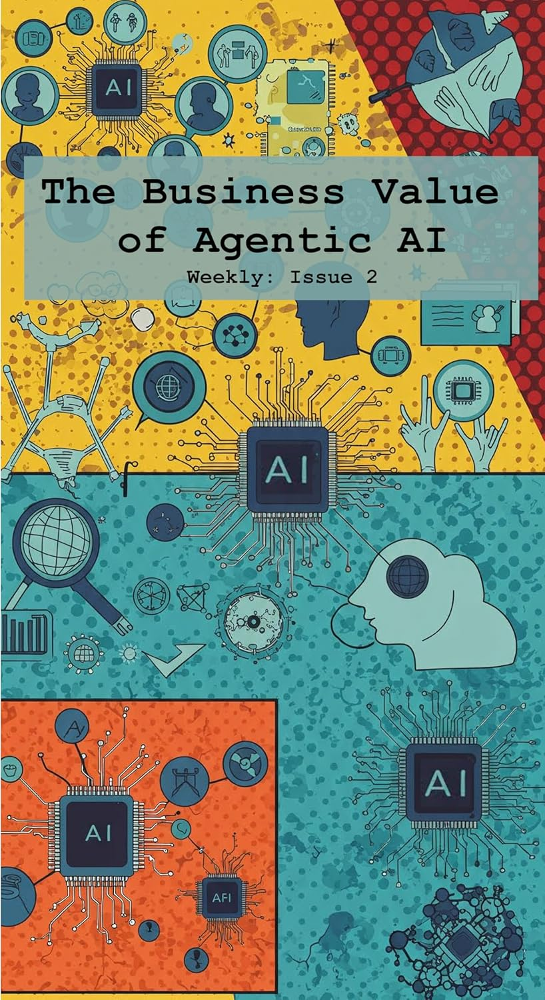

# Business Value of Agentic AI: Unlocking the Future of Intelligent Agents

  
*Cover image of the ebook*

## 📖 [Get the Ebook on Amazon](https://www.amazon.com/dp/B0F4KN1R9F)

---

## Explore the Cutting Edge of AI in the Age of Intelligent Agents

**Business Value of Agentic AI** is your ultimate guide to understanding the latest breakthroughs in artificial intelligence, focusing on **Agentic AI**, **interoperability protocols**, **AI governance**, and **real-world applications**. This ebook dives deep into how intelligent agents are reshaping industries, from development workflows to cloud-native systems.

Discover how **Anthropic's innovations** and **Google's Agent2Agent Protocol (A2A)** are redefining agent interoperability, challenging the **Model Context Protocol (MCP)** standard adopted by OpenAI. Learn how platforms like **mcp.so** are cataloging over 500 new MCP servers daily, driving the rapid adoption of this groundbreaking technology.

Whether you're an **AI enthusiast**, **developer**, or **business strategist**, this ebook provides actionable insights into the transformative potential of Agentic AI.

---

## Who Should Read This Book?

This book is perfect for:
- **AI enthusiasts** who want to stay ahead of the latest trends in intelligent agents.
- **Developers** exploring tools like GitHub Copilot's 'Agent Mode' and MCP integration.
- **Tech strategists** looking to understand the business value of Agentic AI.
- **Cloud-native professionals** integrating Agentic AI into Kubernetes and DevOps workflows.
- **Governance experts** navigating the challenges of AI-driven decision-making.

---

## What You Will Learn

By reading this ebook, you will:
- Understand the rise of **Agentic AI** and its impact on industries.
- Learn about **Google's Agent2Agent Protocol (A2A)** and how it challenges OpenAI's **Model Context Protocol (MCP)**.
- Explore the **MCP Community Hub** and its role in cataloging over 500 new MCP servers daily.
- Discover how **GitHub Copilot's 'Agent Mode'** transforms developer workflows with advanced MCP support.
- Gain insights into **AI governance**, including NIST’s AI Risk Management Framework.
- Understand the business potential of **small language models**, such as Meta’s Llama 4.
- Explore the integration of Agentic AI into **Kubernetes** and the cloud-native ecosystem.
- Learn about the risks of generative AI, including fraud, disinformation, and document forgery.

---

## Key Topics Covered in This Ebook

### The Rise of Agentic AI
Explore how intelligent agents are reshaping industries and driving innovation in AI.

### Introducing the Agent2Agent Protocol
Learn how Google's A2A Protocol redefines agent interoperability and challenges existing standards.

### The MCP Phenomenon
Understand the rapid adoption of the Model Context Protocol (MCP) and its impact on AI ecosystems.

### GitHub Copilot's 'Agent Mode'
Discover how GitHub Copilot's new 'Agent Mode' enhances developer workflows with advanced MCP support.

### Generative AI and Governance
Gain insights into the ethical challenges of generative AI and the role of governance frameworks like NIST’s AI Risk Management Framework.

### The Business Potential of Small Language Models
Learn how smaller models like Meta’s Llama 4 are delivering practical benefits for businesses.

### Kubernetes and Agentic AI in Cloud-Native Systems
Explore how the Kubernetes community is integrating Agentic AI to empower DevOps and platform teams with scalable, intelligent automation.

---

## Why Choose This Ebook?

### Cutting-Edge Insights
Stay ahead of the curve with the latest developments in Agentic AI, interoperability protocols, and governance.

### Practical Applications
Learn how to apply Agentic AI in real-world scenarios, from development workflows to cloud-native systems.

### Ethical Perspectives
Understand the challenges of AI governance and the societal impact of generative AI.

### Business Value
Discover how Agentic AI can drive innovation, improve decision-making, and unlock new opportunities for businesses.

---

## Keywords for SEO Optimization

- Agentic AI book
- Business value of AI
- Intelligent agents in AI
- Google Agent2Agent Protocol (A2A)
- Model Context Protocol (MCP)
- GitHub Copilot Agent Mode
- AI governance frameworks
- NIST AI Risk Management Framework
- Small language models for business
- Meta Llama 4 AI model
- Kubernetes and Agentic AI
- Cloud-native AI automation
- Generative AI risks and governance
- AI interoperability protocols
- AI-driven decision-making

---

## Why Agentic AI Matters

Agentic AI is transforming industries by enabling intelligent agents to interact seamlessly, automate workflows, and make data-driven decisions. This ebook provides the knowledge and tools you need to:
- Stay informed about the latest AI trends and protocols.
- Leverage Agentic AI to improve business operations and decision-making.
- Navigate the ethical challenges of AI governance and generative AI risks.

---

## About the Author

**Wolfgang Beer** is a leading expert in artificial intelligence and technology strategy. With years of experience in AI research and development, Wolfgang provides readers with actionable insights into the rapidly evolving world of Agentic AI and its business applications.

---

## Get Started Today

Ready to explore the cutting edge of Agentic AI?  
📖 [Get the Ebook on Amazon](https://www.amazon.com/dp/B0F4KN1R9F)