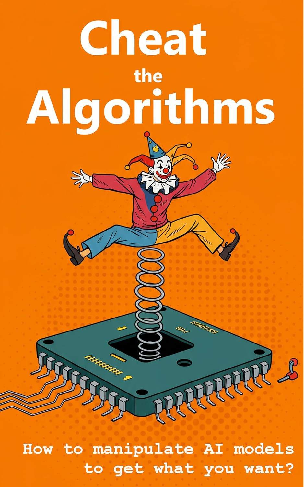

# Cheat the Algorithms: How to Manipulate AI Models to Get What You Want

  
*Cover image of the ebook*

## 📖 [Get the Ebook on Amazon](https://www.amazon.com/dp/B0F6K8314V)

---

## Master the Art of AI Manipulation

**Cheat the Algorithms: How to Manipulate AI Models to Get What You Want** is your ultimate guide to understanding and influencing the AI systems that shape our modern world. From **ChatGPT** to **TikTok’s recommendation engines**, this book explores how AI models subtly influence our decisions, habits, and desires — and how you can turn the tables to influence these systems in your favor.

This book is divided into three powerful sections:
1. **Understanding AI Models**: Learn how tech giants train and deploy AI models like GPT, Claude, and LLaMA to influence purchasing decisions, shape opinions, and control the flow of information.
2. **Manipulating AI Systems**: Discover real-world examples of how individuals have gamed AI systems, from creating fake traffic jams on Google Maps to hacking Spotify playlists.
3. **Practical Techniques**: Gain actionable strategies to nudge AI systems, control recommendation feeds, steer chatbot conversations, and influence algorithm-driven pricing models.

---

## Who Should Read This Book?

This book is perfect for:
- **AI enthusiasts** who want to understand how modern algorithms work.
- **Content creators** looking to optimize their visibility on platforms like TikTok, YouTube, and Spotify.
- **Entrepreneurs** who want to influence AI-driven pricing and recommendation systems.
- **Ethics researchers** exploring the societal impact of AI manipulation.
- Anyone curious about **AI literacy** and how to thrive in an AI-driven world.

---

## What You Will Learn

By reading this book, you will:
- Understand how AI models like GPT, Claude, and TikTok’s recommendation engines are trained and deployed.
- Learn how AI systems influence purchasing decisions, opinions, and behaviors.
- Explore real-world case studies of AI manipulation, including:
  - **Google Maps Jam Hoax**: How 99 smartphones faked a traffic jam.
  - **TikTok Feed Tuning**: How users created niche subcultures by training their own algorithms.
  - **Spotify Playlist Hacking**: How indie artists boosted visibility with clever playlist strategies.
  - **ChatGPT Jailbreaks**: How users bypassed AI guardrails and revealed hidden instructions.
- Gain practical techniques to:
  - Control recommendation feeds on platforms like TikTok and YouTube.
  - Steer chatbot conversations to get better results.
  - Influence algorithm-driven pricing models to your advantage.

---

## Why Choose This Book?

### AI Literacy for the Modern Era
This book provides a clear and accessible introduction to how AI models work and how they influence our daily lives.

### Real-World Examples
Explore fascinating case studies of AI manipulation, from humorous pranks to impactful exploits.

### Practical Techniques
Learn actionable strategies to influence AI systems and take control of your digital experience.

### Ethical Insights
Engage with the ethical debates surrounding AI manipulation and its impact on society.

---

## Key Features of the Book

- **Step-by-Step Learning**: Understand how AI models are trained and deployed.
- **Real-World Case Studies**: Learn from examples like the Google Maps traffic jam hoax and TikTok feed tuning.
- **Actionable Strategies**: Gain practical techniques to influence AI systems and recommendation engines.
- **Ethical Discussions**: Explore the societal implications of AI manipulation.

---

## Why AI Manipulation Matters

AI systems are deeply embedded in every aspect of modern life, from **business** and **entertainment** to **social media** and **e-commerce**. Without AI literacy, individuals risk becoming passive targets of manipulation. This book empowers readers to:
- Understand how AI systems influence their decisions and behaviors.
- Actively engage with AI systems to shape their outcomes.
- Thrive in an AI-driven world by mastering the art of AI manipulation.

---

## About the Author

**Wolfgang Beer** is a technology expert and author with a passion for exploring the intersection of AI, ethics, and human behavior. With years of experience in AI research and practical applications, Wolfgang provides readers with the tools and insights they need to navigate and influence the AI-driven world.

---

## Get Started Today

Ready to master the art of AI manipulation?  
📖 [Get the Ebook on Amazon](https://www.amazon.com/dp/B0F6K8314V)

---

## Keywords for SEO Optimization

- Cheat the Algorithms book
- AI manipulation techniques
- AI literacy and influence
- ChatGPT jailbreaks
- TikTok recommendation engine
- Spotify playlist hacking
- Google Maps traffic jam hoax
- AI-driven pricing models
- AI recommendation feeds
- Ethical AI manipulation
- AI literacy for beginners
- AI models like GPT and Claude
- AI influence on purchasing decisions
- AI in social media algorithms
- Practical AI manipulation strategies

---

## Why Buy This Ebook?

This ebook is your **comprehensive guide** to understanding and influencing AI systems. Whether you’re an AI enthusiast, content creator, or entrepreneur, this book provides the insights and techniques you need to thrive in an AI-driven world.

📖 [Get the Ebook on Amazon](https://www.amazon.com/dp/B0F6K8314V)