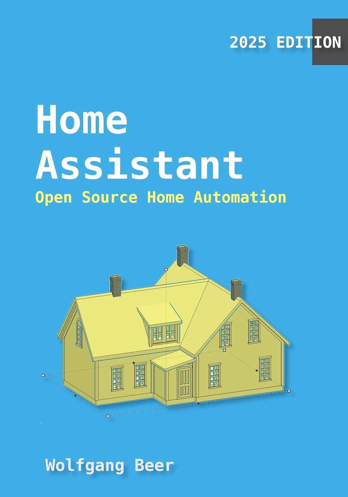

# Home Assistant: An Introduction into Home Assistant and Open Source Home Automation

  
*Cover image of the ebook*

## 📖 [Get the Ebook on Amazon](https://www.amazon.com/dp/B08JJ5PYQJ)

---

## Revolutionize Your Home with Open Source Home Automation

**Home Assistant: An Introduction into Home Assistant and Open Source Home Automation** is your ultimate guide to creating a smarter, more connected home. This book introduces you to the powerful, free, and open-source **Home Assistant software**, empowering you to take full control of your home automation system.

Learn how to:
- Run your own **Home Automation server**.
- Host a **Home Assistant server in Docker**.
- Configure sensors, actuators, and automation scripts.
- Save energy and money with **energy management**.
- Build and integrate custom sensors using affordable hardware like the **ESP8266**.

---

## Who Should Read This Book?

This book is perfect for:
- **Home automation enthusiasts** who want to explore open-source solutions.
- **Makers and tinkerers** ready to dive into soldering and programming.
- Anyone looking to break free from **vendor lock-ins** and create a fully customizable smart home.
- Beginners with basic programming skills who want to learn **DIY home automation**.

---

## What You Will Learn

By reading this book, you will:
- Gain an **introduction to Home Assistant**, the free and open-source home automation platform.
- Learn how to **run your own Home Automation server**.
- Host a Home Assistant server in **Docker** for easy deployment.
- Configure **sensors and actuators** to control your home.
- Write **automation scripts** to manage lights, heating, and other appliances.
- Save energy and money with **energy management and automation**.
- Send notifications using **Telegram**.
- Solder sensors onto affordable **ESP8266 boards**.
- Attach custom sensors to Home Assistant for personalized automation.

---

## Why Choose This Book?

### Beginner-Friendly
Even if you're new to home automation, this book provides clear explanations and step-by-step instructions to help you get started.

### Open Source Freedom
Say goodbye to vendor lock-ins and explore the limitless possibilities of open-source home automation systems.

### Affordable DIY Projects
Learn how to use inexpensive hardware like the **ESP8266** to create custom sensors and expand your smart home capabilities.

### Real-World Applications
Discover how to control lights, heating, pool pumps, door cams, and more with Home Assistant.

---

## Key Features of the Book

- **Step-by-Step Learning**: Start from the basics and progress to advanced home automation concepts.
- **Open Source Focus**: Learn how to use Home Assistant, the leading open-source home automation platform.
- **DIY Projects**: Build and integrate custom sensors using affordable hardware.
- **Energy Management**: Save energy and money with smart automation.
- **Hands-On Examples**: Follow practical examples to configure sensors, write automation scripts, and more.

---

## Why Home Automation Matters

Home automation is transforming the way we live. With open-source platforms like Home Assistant, you can:
- Take full control of your home automation system.
- Save money by avoiding vendor lock-ins and using affordable hardware.
- Customize your smart home to fit your unique needs.
- Reduce energy consumption and contribute to a sustainable future.

This book helps you unlock the full potential of Home Assistant and create a smarter, more connected home.

---

## About the Author

**Wolfgang Beer** is a passionate maker and home automation enthusiast. With years of experience in open-source software and DIY electronics, Wolfgang has helped countless readers take control of their smart homes and unleash their creativity.

---

## Get Started Today

Ready to revolutionize your home with open-source automation?  
📖 [Get the Ebook on Amazon](https://www.amazon.com/dp/B08JJ5PYQJ)

---

## Keywords for SEO Optimization

- Home Assistant book
- Open source home automation
- DIY home automation
- ESP8266 sensors
- Home Assistant Docker setup
- Home automation for beginners
- Smart home energy management
- Home Assistant automation scripts
- Custom sensors for Home Assistant
- Open source smart home
- Home Assistant Telegram notifications
- Affordable home automation
- Home Assistant ESP8266 integration
- Smart home customization
- Home Assistant energy monitoring

---

## Why Buy This Ebook?

This ebook is your **comprehensive guide** to mastering Home Assistant and open-source home automation. Whether you're a beginner or an experienced maker, you'll find valuable insights, practical examples, and DIY projects to help you create a smarter, more connected home.

📖 [Get the Ebook on Amazon](https://www.amazon.com/dp/B08JJ5PYQJ)